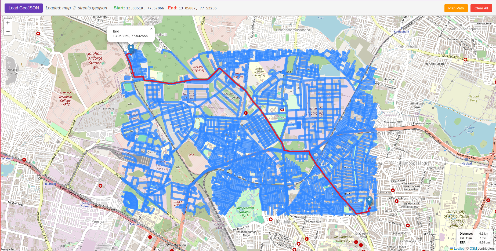

# Flask-OSM-AStar-Router

A web application demonstrating **A\*** pathfinding on **OpenStreetMap (OSM)** data for driving routes. This project uses Flask for the backend, Leaflet.js for the interactive map display, and calculates the estimated **fastest** driving route between two user-selected points, considering road types and speed limits.

## Features

* **Interactive Map:** Uses Leaflet.js for a pannable, zoomable map interface.
* **OSM Data Parsing:** Leverages `pyrosm` to read road network data directly from OpenStreetMap PBF files.
* **Graph Construction:** Builds a weighted graph using `networkx` where nodes represent geographical points and edge weights represent the **estimated travel time**.
* **Fastest Path Calculation:** Implements the **A\* search algorithm** (`networkx.astar_path`) to find the path with the minimum total travel time.
    * Edge weights calculated based on segment length and estimated speed (derived from OSM `highway` and `maxspeed` tags).
    * Uses an admissible heuristic (straight-line distance / max speed) for efficient searching.
* **Route Visualization:** Displays the calculated fastest path on the Leaflet map.
* **ETA & Distance Display:** Shows the estimated total travel time, distance, and ETA for the calculated route.
* **GeoJSON Overlay:** Allows loading and displaying additional GeoJSON features on the map.

## Algorithm Details

1.  **Data Source:** OpenStreetMap data in PBF format (e.g., from Geofabrik).
2.  **Graph Building:**
    * The `pyrosm` library extracts drivable roads (`network_type="driving"`) along with `highway` and `maxspeed` tags.
    * A `networkx.Graph` is constructed where nodes are coordinate tuples `(longitude, latitude)`.
    * Edges represent road segments connecting two nodes.
    * **Edge Weight:** The primary weight (`weight`) for each edge is the estimated **travel time in seconds**, calculated as `segment_distance / estimated_speed_mps`.
    * **Speed Estimation:** Speed (in m/s) is estimated by parsing the `maxspeed` tag (handling km/h and mph) or using defaults based on the `highway` tag (e.g., 'primary', 'secondary', 'residential').
    * Edge distance (`length`) is also stored as an attribute.
3.  **Pathfinding (A\*):**
    * The nearest graph nodes to the user's selected start and end coordinates are found.
    * `networkx.astar_path` is used to find the path minimizing the sum of edge `weight` (time).
    * **Heuristic Function:** An admissible heuristic `h(u, v)` is provided to A\*, estimating the minimum possible remaining time as `straight_line_distance(u, v) / maximum_network_speed`. This guides the search efficiently towards the destination.
4.  **Output:** The resulting path (list of coordinates), total calculated time, and total calculated distance are sent to the frontend for display.

## Technologies Used

* **Backend:** Python, Flask
* **OSM Parsing:** pyrosm
* **Graph & A\*:** NetworkX
* **Geospatial:** GeoPy (for distance), Shapely (used by pyrosm/geopandas)
* **Frontend:** HTML, CSS, JavaScript, Leaflet.js

